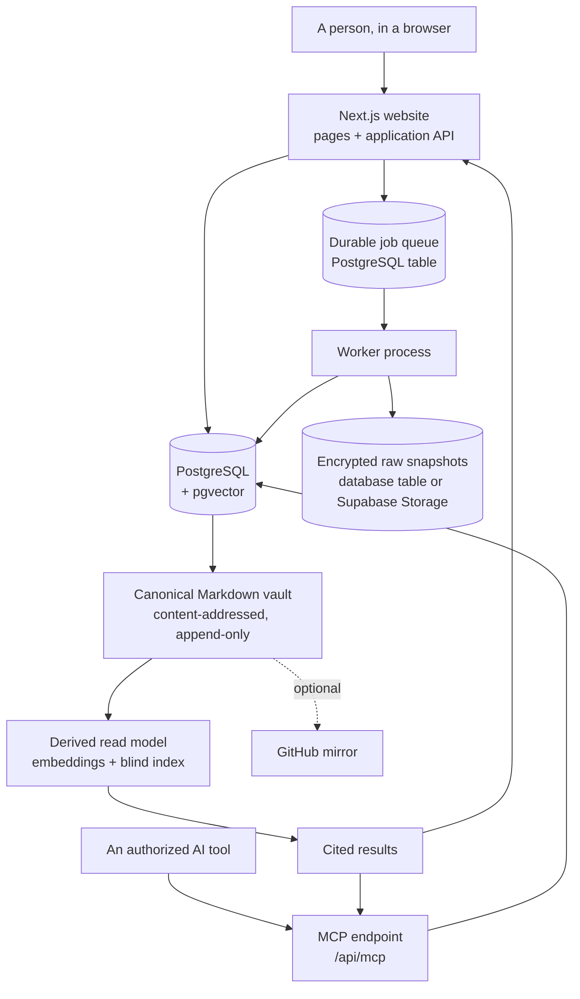

# Architecture

## The shape of it

One repository, one domain model, two processes. The website answers requests;
the worker does anything slow. They share every package, so a rule enforced in
one is enforced in the other.



## Four layers, kept apart on purpose

1. **Raw evidence** — an immutable, encrypted snapshot of exactly what arrived.
   Never edited, never re-fetched to satisfy a citation.
2. **Canonical memory** — approved memory as Markdown documents, stored
   content-addressed with an append-only version history. This is the source of
   truth.
3. **Derived read model** — parsed rows, embeddings, and blind-index terms. All
   of it disposable: `rebuildProjectIndex` reconstructs it, and a test proves the
   rebuilt index returns identical results.
4. **Clients** — the website, the MCP endpoint, exports, and the optional GitHub
   mirror. None of them is authoritative.

The database must not quietly become a second source of truth. Every memory row
carries the canonical path and version it belongs to, and the canonical Markdown
embeds each item's stable identifier, so parsing the Markdown alone recovers the
structure.

## Request path

Every server-side operation takes an explicit `ActorContext` — who is asking, for
which workspace, with which role, and whether they are a person or an AI client.
There is no ambient "current user" to forget to check.

```
cookie → session row → ActorContext → withTenant(...) → query
                                        │
                                        └─ SET LOCAL ROLE cairn_app
                                           SET LOCAL cairn.workspace_id
```

Inside `withTenant` the connection drops to a role that does not own the tables,
so row-level security applies. A query that forgets its `WHERE workspace_id`
still cannot see another tenant's rows. `withSystem` bypasses this and is used
only where there is genuinely no single tenant: sign-in, the worker's claim loop,
migrations, and workspace deletion.

## Ingestion

```
submitSource(bytes)
  ├─ normalize            deterministic text, so offsets stay valid forever
  ├─ store raw snapshot   encrypted, content-addressed, written before the transaction
  ├─ upsert item/revision unique on (workspace, item, content hash) → replays are no-ops
  └─ enqueue source.ingest

source.ingest    chunk the text, encrypt each chunk
  └─ enqueue source.extract

source.extract   check the budget, extract candidates, verify their evidence,
                 detect duplicates and contradictions, write proposals
```

Every job is keyed by an idempotency key derived from content, so a duplicate
webhook, a retried job, or a resumed worker converges rather than duplicating.
A failing job is retried with backoff and then marked dead with a category; a
validation failure is never retried, because it would fail identically.

## Approval

Approving a memory happens in one transaction: the status changes, the item is
indexed, and the canonical documents are re-rendered and committed as a new
version. Either all of it happens or none of it does.

Evidence is structurally required. `assertApprovable` refuses an item with no
evidence record, so "where did you learn that?" always has an answer.

## Retrieval

Order matters, and it is the security property rather than an implementation
detail:

1. Authorization and sensitivity are applied **in SQL**, against plaintext
   metadata columns.
2. Candidates are gathered two ways — vector similarity and blind-index term
   matching — and fused with reciprocal rank fusion.
3. The disclosure rule is applied again in application code, so a mistake in the
   SQL still cannot leak.
4. **Only then** is any ciphertext fetched or any key used.

A memory the caller may not see is never decrypted.

## Why not microservices

The hard part is trust and correctness, not service count. Splitting this up
would add deployment, tracing, and consistency work long before usage justifies
it. Only the worker is separate, and only because ingestion must not run inside a
page request, an OAuth callback, or a webhook response.

## Notes on two local-mode constraints

- **The local database is single-process.** PGlite runs PostgreSQL in-process, so
  the website and a separate worker cannot both open it. In that mode the website
  drains the queue itself, through the same handlers and the same claim path. Set
  `DATABASE_URL` and the worker runs separately, as it does in production.
- **Server chunks each get their own module state.** The database handle and the
  services container are therefore pinned to `globalThis`. Without that, pages and
  route handlers open separate instances — which against the local database means
  a session written by one is invisible to the other.
