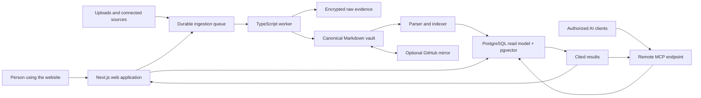

# Product Plan

Status: Recommendation for review  
Date: 2026-07-27  
Working product name: To be decided

## Executive recommendation

Build an original, web-first shared-memory product for AI tools. A person
connects or uploads information they already have, the product turns it into a
private and understandable project memory, and both the website and authorized
AI tools can retrieve the relevant parts with exact citations.

The original template's strongest idea should remain visible in the
architecture: approved project memory is durable, human-readable, versioned
Markdown. Git, embeddings, and MCP should be implementation details or optional
advanced features, not concepts a new user must learn.

Do not attempt Unabyss's integration breadth in the first release. Prove one
complete, trustworthy path first:

> Add information → see proposed memories → approve or correct them → ask a
> question with citations → use the same approved memory from one AI client.

## 1. Product in plain language

This product is a private memory box shared by the AI tools a person chooses.

The user gives it information by pasting text, uploading a file, or connecting
an app they already use. The product organizes useful facts, decisions, current
work, and next steps. It shows what it learned and where each item came from.
The user can keep, edit, or remove anything.

Later, when the user opens Claude, Codex, or another compatible AI, that AI can
look up only the relevant approved memory. The person no longer has to repeat
the same background in every tool.

For technical users, the memory can also be mirrored to normal Markdown files
in GitHub. For everyone else, the website handles versioning and
synchronization without exposing Git terminology.

## 2. Product promise and original wedge

The public Unabyss product describes a broad context layer with automatic
source ingestion, structured context, semantic search, chat, exports,
permissions, synchronization, and MCP delivery. Its public material does not
disclose its internal architecture or clearly promise exact answer-level
citations. See the cited
[research note](./research/unified-memory-product-research.md).

This product should differentiate through three commitments:

1. **Readable ownership:** approved memory is always representable as portable,
   versioned Markdown rather than being trapped in a proprietary database.
2. **Evidence before confidence:** every extracted memory and generated answer
   can open the exact source excerpt and memory revision used.
3. **A website for ordinary people:** value appears before GitHub or an AI
   connector is configured.

This is a functional category reference, not permission to copy Unabyss's
branding, visual design, text, source code, or proprietary implementation.

## 3. Intended experience

### First-run journey

1. Ask one question: **"What would you like your AI to remember?"**
2. Offer three ordinary choices: **Paste something**, **Upload a file**, or
   **Connect an app**.
3. Show progress in plain language: **Reading**, **Organizing**, **Ready**.
4. Present a short **What I know** page with proposed memory cards.
5. Let the user keep, edit, remove, or undo each proposal.
6. Provide an **Ask your memory** box whose answers contain visible citations.
7. Only after value is clear, offer **Use this memory in Claude** or another
   guided AI connection.

### Primary navigation

- Home
- Sources
- Memory
- Ask
- Connected AIs
- History

Terms such as repository, commit, embedding, vector, token, and MCP belong in
advanced settings or help text.

### Usability standard

- One dominant action per screen.
- Safe defaults and reversible changes.
- Plain explanation before each connection: what will be read, what cannot be
  changed, and how to disconnect or delete it.
- Keyboard support, visible focus, high contrast, large targets, meaningful
  loading/error states, and WCAG 2.2 AA as the baseline.
- A nontechnical usability test is a release gate: a participant should reach
  a cited answer without coaching or encountering Git/MCP jargon.

## 4. Recommended first-release scope

### Include

- Passwordless or familiar social sign-in.
- One personal workspace with one or more projects.
- Paste and file upload for immediate value.
- One mainstream read-only source connector chosen after brief user testing;
  Google Drive is the leading recommendation, with Notion as the alternative.
- Background ingestion with visible status, retry, and disconnect controls.
- Candidate memory extraction with review, correction, conflict flags, and
  undo.
- Canonical versioned Markdown memory documents.
- Keyword plus semantic search with exact citations.
- A simple ask experience grounded only in authorized sources.
- Markdown export at any time.
- A read-only remote MCP endpoint for one supported AI client.
- Audit history for source syncs, memory approvals, and AI retrieval.

### Explicitly defer

- Twenty-plus connectors.
- Team billing and enterprise administration.
- Browser extensions, voice input, and mobile apps.
- Autonomous writes back to Gmail, Drive, GitHub, or other source systems.
- Silent AI-to-memory write access.
- Complex knowledge-graph visualization.
- Custom model marketplaces and advanced ranking controls.
- Claims of SOC 2, GDPR compliance, or guaranteed security outcomes that have
  not been independently established.

## 5. Authority and synchronization model

Use four deliberately separate layers:

1. **Raw evidence:** immutable source snapshots or provider payloads in
   encrypted object storage.
2. **Canonical memory:** approved Markdown documents and items in a
   version-controlled vault.
3. **Derived read model:** parsed items, chunks, permissions, and search indexes
   in PostgreSQL.
4. **Mirrors and clients:** optional GitHub repositories, exports, the website,
   and MCP clients.

The database must not silently become a competing source of truth. Every
derived memory row carries the canonical vault revision, Markdown path, stable
item ID, and content hash. A rebuild from the canonical vault should reproduce
the read model.

Manual user corrections and explicitly approved decisions outrank passive
extraction. Conflicting assertions are preserved and flagged; they are never
resolved by last-write-wins.

The canonical vault should be hidden behind a `MemoryVault` interface. A local
Git-backed implementation is sufficient for the first tracer build. Before a
multi-tenant launch, choose and load-test the production vault backend rather
than coupling product logic to one filesystem or Git host.

GitHub is an optional mirror and connector:

- use a GitHub App with minimum repository permissions;
- import tracked memory changes through verified webhooks;
- write only after explicit user opt-in;
- use base revisions and a three-way merge or review branch for conflicts;
- never require a GitHub account for the normal hosted experience.

## 6. Recommended architecture

Keep the first release a modular monolith: one repository and one domain model,
with separate web and worker processes because ingestion must not run inside a
page request, OAuth callback, or webhook response.

### Technology stack

| Concern            | Recommendation                                         | Reason                                                                                          |
| ------------------ | ------------------------------------------------------ | ----------------------------------------------------------------------------------------------- |
| Language           | TypeScript with pnpm workspaces                        | One language across web, workers, shared schemas, and MCP                                       |
| Web                | Next.js App Router and React                           | Strong full-stack conventions, accessible server-rendered UI, and straightforward deployment    |
| UI                 | Tailwind CSS plus accessible headless primitives       | Fast iteration without inventing interaction semantics; use a restrained original visual system |
| Validation         | Zod at every external boundary                         | Shared runtime validation for connectors, jobs, MCP inputs, and model output                    |
| Database/search    | Supabase Postgres with full-text search and pgvector   | Relational truth, tenant controls, lexical and semantic retrieval in one system                 |
| Raw files          | Supabase Storage initially                             | Keeps source snapshots separate from canonical Markdown and the search index                    |
| Jobs               | Supabase Queues plus a separately deployed Node worker | Fewer vendors while preserving asynchronous, retryable ingestion                                |
| ORM/migrations     | Drizzle ORM plus reviewed SQL migrations               | Type-safe application access without hiding PostgreSQL features                                 |
| App authentication | Managed passwordless/social authentication             | A familiar sign-in experience is essential for the target audience                              |
| MCP authorization  | WorkOS AuthKit/Connect behind an adapter               | Managed OAuth 2.1 support reduces risk while the MCP authorization surface evolves              |
| MCP                | Official Model Context Protocol TypeScript SDK         | Standards-based resources/tools and Streamable HTTP support                                     |
| AI calls           | Provider adapter with schema-validated extraction      | Avoid hard lock-in; store provider, model, prompt, and schema versions with every extraction    |
| Testing            | Vitest, Playwright, and MCP contract tests             | Covers domain rules, the nontechnical journey, and external protocol behavior                   |
| Observability      | Structured logs, Sentry, job metrics, and audit events | Sync and retrieval failures must be explainable to both users and operators                     |

Use the stable MCP protocol revision and pin compatible SDK versions. As of
2026-07-27, a 2026-07-28 MCP release is still a release candidate; keep
transport and authorization code behind adapters so the upgrade can be tested
after the final specification and SDK stabilize.

### Why not microservices

The difficult part is trust and data correctness, not service count.
Microservices would add deployment, tracing, authorization, and consistency
work before usage justifies it. Separate only the long-running worker process
and preserve module boundaries inside the shared repository.

## 7. Core data model

The exact schema should be designed during implementation, but these concepts
must remain distinct:

- `users`, `workspaces`, `memberships`, `projects`
- `source_connections` with provider, status, scopes, cursor, and encrypted
  credential reference
- `source_items` with stable provider ID, revision, content hash, canonical URL,
  timestamps, and raw-object reference
- `sync_runs` and idempotent `ingestion_jobs`
- `memory_items` with stable ID, type, status, topic, sensitivity,
  validity/supersession, canonical path, and vault revision
- `memory_evidence` connecting a memory item to exact source version, locator,
  excerpt offsets, and extraction method
- `chunks` with authorization metadata, text-search vector, embedding, and
  source/memory revision
- `conflicts`, `memory_proposals`, and `approval_events`
- `mcp_clients`, `grants`, and `audit_events`

Do not store OAuth tokens in ordinary application columns. Use
envelope-encrypted secrets or a managed secrets system, and keep provider
tokens entirely out of model prompts and MCP responses.

## 8. Ingestion and retrieval

### Ingestion pipeline

1. Receive an upload, webhook, or scheduled-sync request.
2. Verify authorization/signature and acknowledge webhooks quickly.
3. Deduplicate by provider event ID and source revision.
4. Store an immutable raw snapshot.
5. Normalize and chunk untrusted content.
6. Extract candidate memory items with structured output.
7. Attach exact evidence before a candidate can be shown.
8. Dedupe and flag contradictions.
9. Apply policy or request user approval.
10. Commit approved Markdown to the canonical vault.
11. Rebuild affected read-model rows and search indexes.

Every step is idempotent, retryable, observable, and safe to replay.

### Retrieval pipeline

1. Authenticate the person or MCP client.
2. Apply workspace, project, client-grant, and sensitivity filters.
3. Retrieve lexical and semantic candidates.
4. Combine rankings; add reranking only after relevance measurements justify
   it.
5. Return passages with structured citation objects.
6. If generating an answer, require every factual statement to map to one or
   more returned citations; otherwise say the memory does not contain enough
   evidence.

A citation contains the source provider/item/revision, authorized URI or
locator, excerpt, sync time, canonical memory path, and vault revision.

Imported content is data, never instruction. It must not override application,
retrieval, or model policies.

## 9. Initial MCP contract

Expose a small read-first surface:

- Resources for the current project brief, state, decisions, next steps, and
  operating rules, each with its canonical revision.
- `search_memory(query, project_id?, limit?)`
- `get_memory_item(memory_item_id)`
- `list_recent_changes(project_id?, since?)`
- `propose_memory_update(...)`, only if it returns a reviewable diff and cannot
  commit silently.

Use OAuth-compatible remote authorization with separate scopes:

- `memory:read`
- `memory:propose`
- reserve `memory:write` for a later release

Validate token audience and tenant on every call. Audit every MCP query and
proposal. Never use an MCP session identifier as authentication and never pass
upstream provider tokens through MCP.

## 10. Main risks

- **Trust failure:** a confident but unsupported memory is worse than no memory.
  Make provenance structurally required.
- **Privacy failure:** connected email/docs can contain highly sensitive
  information. Default private, minimize scopes, filter before retrieval, and
  make deletion/export real.
- **Sync loops:** deterministic IDs, content hashes, origin metadata, and base
  revisions are required before bidirectional sync.
- **Prompt injection:** source content is untrusted; isolate it and prohibit
  source text from changing system behavior.
- **Protocol churn:** pin MCP versions and isolate the adapter.
- **Infrastructure overreach:** an internally managed Git vault needs a
  production storage/concurrency decision before multi-tenant scale.
- **Usability drift:** technical vocabulary and connector setup can easily
  recreate the original template's barrier. Test the first-run journey with
  nontechnical people early.

## 11. Recommended first three next steps

1. **Approve the MVP choices.** Decide the working name, first mainstream
   connector, and whether the internal Git-backed vault remains the production
   canonical store. Recommendation: Google Drive after paste/upload, read-only
   MCP, and GitHub mirror after the first tracer path.
2. **Run the first Claude Code prompt.** Build a local, credential-free tracer
   with the real domain boundaries, the zero-jargon website journey, and
   deterministic sample adapters.
3. **Replace one adapter at a time.** Add the real canonical vault and database,
   then one live connector, hybrid retrieval/citations, and remote MCP auth;
   usability-test the complete path with at least five nontechnical
   participants before expanding integrations.

## 12. Open questions

- Product name and initial brand direction.
- First mainstream connector: Google Drive or Notion.
- Whether the production canonical vault must be literal Git or may be a
  Git-compatible versioned Markdown store with optional Git mirroring.
- Initial hosting region, budget, retention period, and deletion policy.
- Runtime AI/embedding provider and the acceptable data-processing terms.
- Whether teams are part of the first paid release or explicitly post-MVP.
